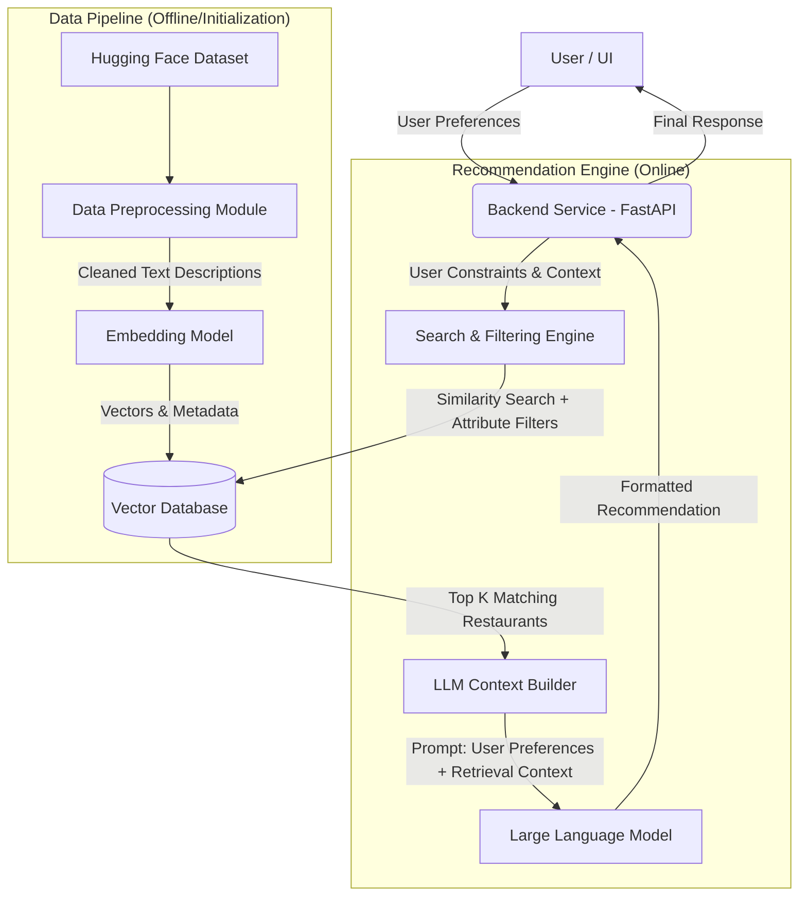

# AI Restaurant Recommendation Service Architecture

## Overview
This document outlines the architecture and phased development plan for an AI-powered Restaurant Recommendation Service. The system takes user preferences (price, place, rating, cuisine), processes them using a Large Language Model (LLM) alongside a Retrieval-Augmented Generation (RAG) approach, and provides clear, personalized restaurant recommendations.

**Data Source**: Hugging Face Dataset (`ManikaSaini/zomato-restaurant-recommendation`)

---

## System Architecture

The architecture is built around a Retrieval-Augmented Generation (RAG) pattern. This approach ensures the LLM provides factually accurate recommendations grounded in real Zomato data, rather than hallucinating places that don't exist.

### Core Components

1. **User Interface / Client**: Captures inputs like location, budget, preferred cuisines, and desired ratings. This can be built rapidly using **Streamlit** or **Gradio**.
2. **Backend Application**: A robust API (typically **FastAPI**) to orchestrate the flow between the user query, the vector database, and the LLM.
3. **Data Preprocessing & Ingestion**: A module that downloads the dataset from Hugging Face, cleans missing values, normalizes attributes (like cost for two), and engineers a "Document String" for each restaurant that is easily embeddable.
4. **Vector Database**: A fast storage solution (e.g., **FAISS**) that stores restaurant embeddings. It will support similarity search for cuisine/vibe mapping, alongside metadata filtering (e.g., strictly filtering out restaurants below a rated score or above a certain price).
5. **Embedding Model**: An open-source model (like `sentence-transformers/all-MiniLM-L6-v2`) used to convert restaurant textual descriptions and user queries into high-dimensional space.
6. **Large Language Model (LLM)**: Takes the retrieved restaurants and the user's specific request to synthesize a conversational, nicely formatted recommendation. It explains *why* a particular restaurant was chosen based on the preferences.

---

## Development Phases

### Phase 1: Data Acquisition & Preprocessing
**Goal**: Obtain the Zomato dataset and prepare it for search indexing.
* **Tasks**:
  * Download the `ManikaSaini/zomato-restaurant-recommendation` dataset using the `datasets` Python library.
  * Explore and clean the data. Handle null values, normalize pricing structures, and split up comma-separated cuisine lists.
  * **Feature Engineering**: Combine key features into a single, rich text block per restaurant. 
    * *Example: "The Spice Room is a North Indian restaurant located in Connaught Place. It has a high rating of 4.5/5.0 and costs approximately 1500 for two people."*
  * Extract metadata (exact rating float, exact price integer, categorical location) for hard filtering later.

### Phase 2: Vector Search & Retrieval Setup
**Goal**: Build the system's ability to find relevant restaurants based on a user's structured constraints.
* **Tasks**:
  * Select and initialize an embedding model from Hugging Face.
  * Generate vector embeddings for every preprocessed restaurant description.
  * Set up a vector database (e.g., FAISS).
  * Insert the embeddings alongside their specific metadata (price, rating, cuisine, location).
  * Build an advanced retrieval function that performs hybrid search. E.g., Use metadata filters to strictly match "Location == X" and "Price <= Y", then use vector similarity to find the best match for the cuisine preferences.

### Phase 3: LLM Integration & Prompt Engineering
**Goal**: Generate human-like, personalized recommendations based on the retrieved data.
* **Tasks**:
  * Use **Groq** as the LLM provider (leveraging Llama 3 or Mixtral) for low-latency, high-speed response generation.
  * Design a system prompt setting the LLM's persona as an expert local food guide.
  * **Implement the RAG workflow:** 
    * Inject the Top N retrieved restaurant details into the prompt context.
    * Append the user's specific preferences.
  * Implement guardrails in the prompt: Instruct the LLM to *only* recommend restaurants provided in the context, and smoothly inform the user if no restaurants met their strict criteria.

### Phase 4: Backend API Development
**Goal**: Expose the recommendation engine as a reliable web service.
* **Tasks**:
  * Set up a FastAPI project structure.
  * Define Pydantic models for the input `UserPreferencesRequest` (price range, location, cuisines, min rating) and the output `RecommendationResponse`.
  * Wrap the retrieval and LLM logic into a POST endpoint (`/api/v1/recommend`).
  * Add error handling and logging.

### Phase 5: User Interface Page
**Goal**: Provide a premium, interactive frontend for users to test and consume the service.
* **Tasks**:
  * Develop a modern, responsive UI page using **Streamlit**.
  * Implement an intuitive dashboard with sidebar controls:
    * Price Range (Slider)
    * Location/Place (Dropdown)
    * User Rating (Minimum threshold slider)
    * Cuisines (Multi-select)
  * Connect the frontend to the FastAPI backend service.
  * Render LLM-generated recommendations using clean Markdown with visual highlights for restaurant names and ratings.
  * Add a "Copy to Clipboard" or "Share" functionality for recommendations.
